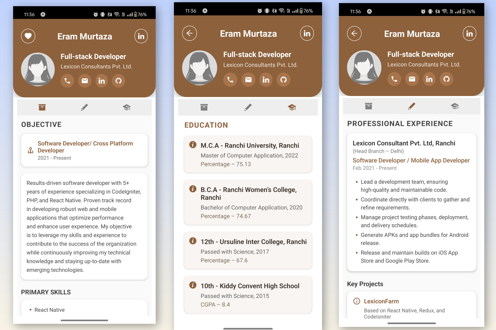

💼 My Portfolio App
A personal Portfolio Application built with React Native to showcase my education, experience, and projects in an elegant, mobile-friendly way.
It’s designed to highlight my skills and demonstrate my React Native UI/UX development capabilities.

🚀 Features
📄 About Me Section – Displays name, contact info, and professional summary
🎓 Education Section – Structured academic details with clean design
💼 Projects Section – Lists real-world projects with tech stacks and highlights
⚙️ Skills Section – Displays programming languages, tools, and frameworks
📱 Fully Responsive UI – Works smoothly across all screen sizes
🌗 Attractive Layout – Professional design with icons, colors, and spacing
🧠 Tech Stack
Framework: React Native (Expo)
State Management: Redux
Backend (optional): CodeIgniter / PHP (for project data)
Styling: StyleSheet & Flexbox
Libraries Used:
react-native-vector-icons
react-navigation
expo-print & expo-sharing (for export/share features)
🧩 Sections in App
🧑‍💻 Profile
Includes name, location, contact details, and summary.

🎓 Education
Displays all academic qualifications:

MCA – Ranchi University, 2022 (75.13%)
BCA – Ranchi Women’s College, 2020 (74.67%)
12th – Ursuline Inter College, 2017 (67.6%)
10th – Kiddy Convent High School, 2015 (CGPA 8.4)
💼 Projects
LexiconFarm – React Native + CodeIgniter (Milk Delivery App)
HMS (Hospital Management System) – CodeIgniter
CPM – React Native + Redux + CodeIgniter
SMA (Society Management App) – React Native + CodeIgniter
⚙️ Technologies
Languages: PHP, JavaScript, HTML, CSS
Frameworks: React Native, Redux, CodeIgniter
Tools: Expo, Git, Android Studio
Software: APK (React Native + Expo)
OS: Windows, macOS, Linux

📲 APK Demo
## Screenshots

👩‍💻 Developer
Name: Eram Murtaza
Location: Ranchi, Jharkhand
Role: React Native Developer | Software Developer
Experience: 5+ years
